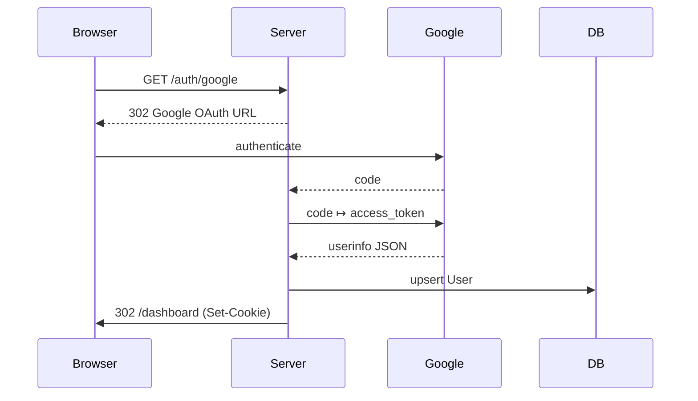

# Monolith Documentation

Welcome to the **Monolith** reference guide.  
This document explains every major subsystem of the project and shows how the pieces fit together.  
If you are new, start with **Quick‑start** then come back to read the architecture chapters.


---

## Table of Contents

1. [Introduction](#introduction)  
2. [Project Layout](#project-layout)  
3. [Core Concepts](#core-concepts)  
   1. [Configuration](#configuration)  
   2. [Database Layer](#database-layer)  
   3. [Domain Models](#domain-models)  
   4. [Sessions & Authentication](#sessions--authentication)  
   5. [Middleware](#middleware)  
   6. [Routing & HTTP Handlers](#routing--http-handlers)  
   7. [Templates & Static Assets](#templates--static-assets)  
   8. [WebSockets](#websockets)  
   9. [Job Queue](#job-queue)  
   10. [Server Management & Zero‑downtime Deploys](#server-management--zero-downtime-deploys)  
   11. [Debugging & Profiling](#debugging--profiling)
4. [Practical Walk‑throughs](#practical-walkthroughs)  
   1. [Quick‑start](#quickstart)  
   2. [Authentication flow](#authentication-flow-example)  
   3. [WebSocket chat](#websocket-chat-example)  
   4. [Background job](#background-job-example)  
   5. [Interactive debug session](#interactive-debug-session)  
5. [Extending the Monolith](#extending-the-monolith)  
6. [Development](#development)
7. [Testing](#testing)
8. [Server Setup](#server-setup)
9. [Deployment](#deployment)
10. [Appendix](#appendix)

---

## Introduction

**Monolith** is a full‑stack Go application that demonstrates:

* Cookie‑based sessions with OAuth 2.0 login  
* GORM‑powered persistence (SQLite by default) 
* Zero downtime deploys
* A tiny background job queue  
* Real‑time WebSocket messaging  
* Structured logging, graceful shutdown, & systemd socket activation  
* Embedded templates and static assets  
* Built‑in performance profiling with the standard library  

Everything uses the **Go standard library** except two focused dependencies:

| Purpose | Package |
| --- | --- |
| Database driver | `github.com/glebarez/sqlite` |
| Sessions + OAuth | `github.com/gorilla/sessions`, `golang.org/x/oauth2` |

---

## Project Layout

```
.
├── main.go                  # Program entry‑point
├── config/                  # Compile‑time configuration knobs
│   └── config.go
├── db/                      # DB connection bootstrap
│   └── db.go
├── models/                  # GORM models (User, Job, Message)
├── handlers/                # HTTP handlers (HTML + auth callbacks)
├── middleware/              # Reusable HTTP middleware
├── session/                 # Session helpers & Google OAuth config
├── ws/                      # WebSocket hub, client & message types
├── jobs/                    # Simple in‑process job queue
├── templates/               # `embed`ded HTML templates
├── static/                  # `embed`ded public files
├── server_management/       # systemd helpers + deployment scripts
└── tests, Makefile, etc.
```

---

## Core Concepts
### Configuration

`config/config.go` contains **constants** that rarely change at runtime, e.g.

```go
const JOB_QUEUE_NUM_WORKERS = 4
```

Everything dynamic (port, database DSN, OAuth keys) is read from **environment variables** inside `main.go` or the relevant package:

| Variable | Default | Used in |
| -------- | ------- | ------- |
| `BIN_PORT` | `9000` | HTTP listener |
| `GOOGLE_CLIENT_ID` / `GOOGLE_CLIENT_SECRET` | – | `session/` |
| `LISTEN_FDS`, `LISTEN_PID` | – | systemd socket activation |

### Database Layer

`db/db.go` initialises a GORM connection:

```go
dbHandle, err = gorm.Open(sqlite.Open("app.db"), &gorm.Config{})
```

Switching to Postgres is one line:

```go
// import "gorm.io/driver/postgres"
gorm.Open(postgres.Open(os.Getenv("DATABASE_URL")), &gorm.Config{})
```

`db.Connect()` runs **auto‑migration** for every registered model so your schema stays in sync.

### Domain Models

| Model | File | Purpose |
| ----- | ---- | ------- |
| `User` | `models/user.go` | Registered users (email, avatar, flags) |
| `Job`  | `models/jobs.go` | Background work unit with `Type` & `Status` enums |
| `Message` | `models/ws.go` | Persisted WebSocket chat message |

All models embed GORM timestamps, so you automatically get `CreatedAt` / `UpdatedAt`.

Example: Creating a user

```go
user, _ := models.CreateUser(db.GetDB(),
    "foo@example.com", "Foo Bar", "https://gravatar.com/avatar/…")
```

### Sessions & Authentication

Session helpers live in `session/session.go`:

* **SecureCookie** store (`gorilla/sessions`)
* `SetLoggedIn`, `Logout`, `IsLoggedIn`
* Google OAuth 2.0 configuration (`oauth2.Config`)

Authentication flow (`handlers/auth.go`):



If `session.IsLoggedIn(r)` is **false**, the `middleware.RequireLogin` decorator redirects the request to `/login`.

### Middleware

Two middlewares are shipped:

| File | Function | Description |
| ---- | -------- | ----------- |
| `middleware/logging.go` | `LoggingMiddleware` | Structured request log using `log/slog` |
| `middleware/auth.go` | `RequireLogin` | Gate routes behind authentication |

Compose them like:

```go
mux := http.NewServeMux()
mux.HandleFunc("GET /dashboard", middleware.RequireLogin(handlers.Dashboard))
http.ListenAndServe(":9000", middleware.LoggingMiddleware(mux))
```

### Routing & HTTP Handlers

All handlers are in `handlers/` and are wired inside `main.go` using the **new routing syntax** (Go 1.22+):

```go
mux.HandleFunc("GET /", handlers.Home)
mux.HandleFunc("POST /items/new", handlers.CreateItemHandler)
```

Templates are parsed once during startup through `handlers.InitTemplates(embed.FS)` giving you the full power of Go’s `html/template`.

### Templates & Static Assets

Assets live beside code but are **embedded** thanks to the `embed` package:

```go
//go:embed static templates
var staticFiles, templateFiles embed.FS
```

* `static/` is served under `/static/…`
* `templates/*.html.tmpl` are executed server‑side

This makes the final binary self‑contained & easy to deploy.

### WebSockets

`ws/` implements a **publish/subscribe hub** inspired by Django Channels:

* `Hub` – central switchboard; one per process  
* `Client` – represents one browser connection  
* Messages are JSON encoded and stored in the DB for history.

Upgrading a request to WebSocket:

```go
func HandleWS(hub *ws.Hub) http.HandlerFunc {
    return func(w http.ResponseWriter, r *http.Request) {
        ws.ServeWs(hub, w, r) // handles upgrade & registration
    }
}
```

Broadcast from anywhere:

```go
hub.Broadcast("chat", []byte("Hello, world!"))
```

### Job Queue

`jobs/` is a minimal in‑process queue with workers:

```go
jobs.RegisterHandler(models.JobTypePrint, func(j *models.Job) error {
    fmt.Println(j.Payload)
    return nil
})
jobs.Enqueue(models.JobTypePrint, `"Hello background!"`)
```

Features:

* FIFO ordering backed by the `jobs` DB table  
* Automatic retries & exponential back‑off (see `JobQueue.process()`)  
* Configurable workers via `config.JOB_QUEUE_NUM_WORKERS`

### Server Management & Zero‑downtime Deploys

`server_management/` abstracts **systemd socket activation**:

* `SdListeners()` fetches inherited file descriptors.  
* `SdNotifyReady()` (see `main.go`) tells systemd we reached *READY*.

The `deploy.sh` and `server_setup.sh` scripts show how to:

1. Build the binary with `make build`
2. Upload & atomically switch `/opt/monolith/current -> new`
3. `systemctl restart monolith.service` (systemd sends **SIGTERM** by default)

Because the listener is handed over, the old process finishes in‑flight requests while the new one starts accepting immediately → **zero downtime**.

### Debugging & Profiling

The `/debug/pprof/*` routes are already mounted:

```
GET /debug/pprof/
GET /debug/pprof/profile   # CPU profile
GET /debug/pprof/heap      # Heap snapshot
```

Example CPU profile for 30 s:

```bash
go tool pprof http://localhost:9000/debug/pprof/profile?seconds=30
```

---

## Practical Walk‑throughs

### Quick‑start

```bash
# 1. clone & enter
git clone <repo> && cd monolith

# 2. (optional) export OAuth creds
export GOOGLE_CLIENT_ID=…
export GOOGLE_CLIENT_SECRET=…

# 3. if you have air installed, run the following in the root of the repo
make

# if you do not have air installed then run
make run

# open http://localhost:9000
```

The first launch creates **app.db** and auto‑migrates the schema.

### Authentication flow Example

1. Browser hits `/auth/google`  
2. Login at Google, consent → redirect back  
3. A `secure` cookie called `session` is set  
4. Visit `/dashboard` – you’ll see your profile

To log out, hit `/logout` which calls `session.Logout`.

### WebSocket chat Example

```html
<script>
const sock = new WebSocket("ws://localhost:9000/ws?channel=chat");
sock.onmessage = ev => console.log("got:", JSON.parse(ev.data));
sock.onopen    = _  => sock.send(JSON.stringify({content: "Hello!"}));
</script>
```

All messages are persisted and broadcast to every subscriber of `chat`.

### Background job Example

```go
payload := `{"numbers":[3,5,7]}`
jobs.Enqueue(models.JobTypeSum, payload)
```

`jobs.RegisterHandler` in `main.go` registers a function that deserialises the JSON and stores the numeric sum back to the DB.

### Interactive debug session

```bash
# in one terminal
go run .            # start app

# in another
curl http://localhost:9000/debug/pprof/heap > heap.out
go tool pprof heap.out
```

---

## Extending the Monolith

### Adding a new Service Layer module

Create `services/email.go`:

```go
package services

func SendWelcome(to string) error {
    // …
}
```

Import and call it from handlers or jobs – services keep business logic away from HTTP glue.

### New Job Type

```go
const JobTypeEmail models.JobType = iota + 2

jobs.RegisterHandler(JobTypeEmail, func(j *models.Job) error {
    var p struct{ To, Subject, Body string }
    json.Unmarshal([]byte(j.Payload), &p)
    return services.SendEmail(p.To, p.Subject, p.Body)
})
```

### Custom WebSocket Channel

```go
hub.Subscribe(client, "notifications")
hub.Broadcast("notifications", []byte(`{"title":"Build finished"}`))
```

---

## Testing

Run the unit tests by running following in the root of the repo:

```bash
make test
```

`handlers/handlers_test.go` shows how to spin up an in‑memory HTTP server and assert redirects.

---
## Development
If you have `air` installed, then you can start a development server with hot reloading by running the following in the root of the repo:
```
make
```

Otherwise, just run the app with:
```
go run main.go
```

You can also create a standalone binary with:
```bash
make build
```
---
## Server Setup
Assuming you have a newly created ubuntu server that you have ssh access into, just run:
```bash
./server_management/server_setup.sh root@{{ip address of server}} {{domain name}}
```

where `ip address of server` is the IP address of your server and `domain name` is the domain that will be served by your server.

For example,
```bash
./server_management/server_setup.sh root@203.0.113.5 example.com
```

---

## Deployment


Run the following from the root of the repo:

`make deploy`

This will do a zero downtime deploy by calling,
```bash
./server_management/deploy.sh
```

---

## Appendix

### Environment Variables

| Name | Description | Default |
| ---- | ----------- | ------- |
| `BIN_PORT` | Fallback TCP port when not using socket activation | `9000` |
| `GOOGLE_CLIENT_ID` | OAuth 2 client ID | – |
| `GOOGLE_CLIENT_SECRET` | OAuth 2 client secret | – |
| `DATABASE_URL` | Postgres DSN (if you switch drivers) | – |

### Make Targets

| Command | Effect |
| ------- | ------ |
| `make`       | Run a hot reloaded development server using `air`
| `make build` | Build a statically linked binary |
| `make run`   | `go run ./...` |
| `make test`  | `go test ./...` |
| `make deploy`|

---